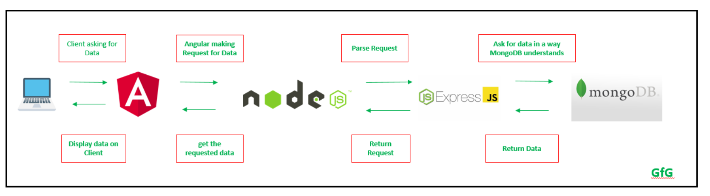
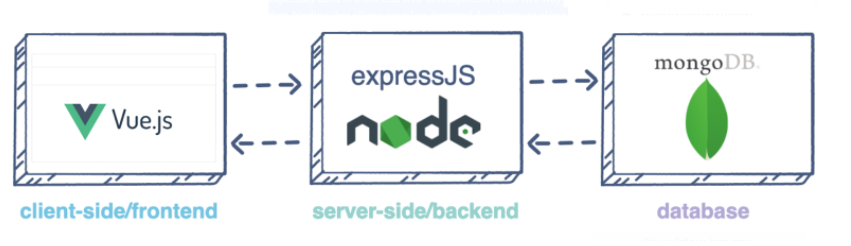
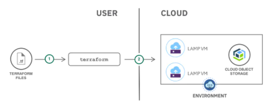

# Google Developer Students Club, IIITV

## **Web Dev Resources**

Web development is basically divided into three parts -

1. Front-end
2. Back-end
3. Database

**Step 1:** Learning basic **frontend** (even if you are more inclined towards algorithms and backend)

To learn frontend, chronology samajhiye ;)

1. HTML

   - Reading material - [**https://www.w3schools.com/html/default.asp**](https://www.w3schools.com/html/default.asp)
   - Video material - [**https://www.youtube.com/watch?v=BsDoLVMnmZs**](https://www.youtube.com/watch?v=BsDoLVMnmZs)

2. CSS

   - Reading material - [**https://www.w3schools.com/css/default.asp**](https://www.w3schools.com/css/default.asp)

   - Video material - [**https://www.youtube.com/watch?v=Edsxf_NBFrw**](https://www.youtube.com/watch?v=Edsxf_NBFrw)

3. Javascript

   - Reading material -[**https://developer.mozilla.org/en-US/docs/Web/JavaScript**](https://developer.mozilla.org/en-US/docs/Web/JavaScript)
   - Video material -

     1. Beginner - [**https://youtu.be/hKB-YGF14SY**](https://youtu.be/hKB-YGF14SY)
     2. Advance - [**https://youtu.be/pN6jk0uUrD8**](https://youtu.be/pN6jk0uUrD8) (in detail)

4. Bootstrap

   - Reading material - [**https://getbootstrap.com/docs/5.1/getting-started/introduction/**](https://getbootstrap.com/docs/5.1/getting-started/introduction/)

5. Other CSS libraries - [Top 10 CSS libraries](https://blog.logrocket.com/top-10-css-libraries-to-empower-your-web-design/#:~:text=css%20describes%20itself%20as%20a,%2C%20lightweight%2C%20and%20easily%20deployable.&text=css%20gives%20you%20a%20full,tools%20to%20customize%20your%20CSS.) (if you are more inclined to frontend)

6. Framework - React / Angular / Vue (This is must, choose any one)

   1. React

      - Reading material - [https://reactjs.org/docs/getting-started.html](https://reactjs.org/docs/getting-started.html)

      - Video material - [https://www.youtube.com/playlist?list=PLwGdqUZWnOp3aROg4wypcRhZqJG3ajZWJ](https://www.youtube.com/playlist?list=PLwGdqUZWnOp3aROg4wypcRhZqJG3ajZWJ)

   2. Angular

      - Reading material - [https://angular.io/docs](https://angular.io/docs)

      - Video material - [https://www.youtube.com/playlist?list=PL8p2I9GklV45--5t7_N4lveUI6Y31vQ6C](https://www.youtube.com/playlist?list=PL8p2I9GklV45--5t7_N4lveUI6Y31vQ6C)

   3. Vue

      - Reading material -[https://vuejs.org/v2/guide/](https://vuejs.org/v2/guide/)

      - Video material - [https://www.youtube.com/playlist?list=PL4cUxeGkcC9gQcYgjhBoeQH7wiAyZNrYa](https://www.youtube.com/playlist?list=PL4cUxeGkcC9gQcYgjhBoeQH7wiAyZNrYa)

**Step 2:** Master in **Back-end** by following the below steps (choose any one)

1. Node.js , express.js (based on javascript) -

   - Reading material - [https://www.w3schools.com/nodejs/](https://www.w3schools.com/nodejs/)

   - Video material - [https://youtube.com/playlist?list=PLwGdqUZWnOp00IbeN0OtL9dmnasipZ9x8](https://youtube.com/playlist?list=PLwGdqUZWnOp00IbeN0OtL9dmnasipZ9x8)

2. Django(based on python)

   - Reading material - [https://docs.djangoproject.com/en/3.2/](https://docs.djangoproject.com/en/3.2/) (Best documentation)

   - Video Material:

     - [https://youtu.be/JxzZxdht-XY](https://youtu.be/JxzZxdht-XY)[https://www.youtube.com/playlist?list=PL6gx4Cwl9DGBlmzzFcLgDhKTTfNLfX1IK](https://www.youtube.com/playlist?list=PL6gx4Cwl9DGBlmzzFcLgDhKTTfNLfX1IK)

     - [https://www.youtube.com/playlist?list=PL-osiE80TeTtoQCKZ03TU5fNfx2UY6U4p](https://www.youtube.com/playlist?list=PL-osiE80TeTtoQCKZ03TU5fNfx2UY6U4p)

3. Servlet and JSP (based on java)

   - Reading material - [https://www.javatpoint.com/servlet-tutorial](https://www.javatpoint.com/servlet-tutorial)

   - Video Material - [https://youtube.com/playlist?list=PL0zysOflRCel5BSXoslpfDawe8FyyOSZb](https://youtube.com/playlist?list=PL0zysOflRCel5BSXoslpfDawe8FyyOSZb)

4. PHP

   - Reading material - [https://www.w3schools.com/php/](https://www.w3schools.com/php/)

   - Video Material - [https://youtu.be/1SnPKhCdlsU](https://youtu.be/1SnPKhCdlsU)

5. Golang

   - Reading material - [https://golang.org/doc/](https://golang.org/doc/)

   - Reading material - [https://tutorialedge.net/golang/creating-restful-api-with-golang/](https://tutorialedge.net/golang/creating-restful-api-with-golang/)

**Step 3** : **Database**

1. MySQL -

- Reading material - [https://www.w3schools.com/sql/](https://www.w3schools.com/sql/)

- Video Material - [https://youtu.be/5bFxbwjN-Gk](https://youtu.be/5bFxbwjN-Gk)

2. MongoDB -

- Reading material - [https://www.tutorialspoint.com/mongodb/index.htm](https://www.tutorialspoint.com/mongodb/index.htm)

- Video Material - [https://youtube.com/playlist?list=PLwGdqUZWnOp1P9xSsJg7g3AY0CUjs-WOa](https://youtube.com/playlist?list=PLwGdqUZWnOp1P9xSsJg7g3AY0CUjs-WOa)

1. PostgreSQL

- Reading material - [https://www.postgresqltutorial.com/](https://www.postgresqltutorial.com/)
- Video material - [https://www.youtube.com/playlist?list=PLk1kxccoEnNEtwGZW-3KAcAlhI_Guwh8x](https://www.youtube.com/playlist?list=PLk1kxccoEnNEtwGZW-3KAcAlhI_Guwh8x)

1. Elasticsearch

   - Video material - [https://www.youtube.com/playlist?list=PLGZAAioH7ZlO7AstL9PZrqalK0fZutEXF](https://www.youtube.com/playlist?list=PLGZAAioH7ZlO7AstL9PZrqalK0fZutEXF)

1. MariaDB
   - Reading material - [https://www.tutorialspoint.com/mariadb/index.htm](https://www.tutorialspoint.com/mariadb/index.htm)

**Famous stacks - (choose any one)**

Stacks are basically combinations of technologies that are mostly used together to build web applications.

1. MERN -

   **MERN** stack is a web development framework. It consists of MongoDB, ExpressJS, ReactJS, and NodeJS as its working components. Here are the details of what each of these components is used for in developing a web application when using MERN stack:

   - **MongoDB** : A document-oriented, No-SQL database used to store the application data.
   - **NodeJS** : The JavaScript runtime environment. It is used to run JavaScript on a machine rather than in a browser.
   - **ExpressJS** : A framework layered on top of NodeJS, used to build the backend of a site using NodeJS functions and structures. Since NodeJS was not developed to make websites but rather run JavaScript on a machine, ExpressJS was developed.
   - **ReactJS** : A library created by Facebook. It is used to build UI components that create the user interface of the single page web application.

2. MEAN

   The term MEAN stack refers to a collection of JavaScript based technologies used to develop web applications. MEAN is an acronym for MongoDB, ExpressJS, AngularJS and Node.js. From client to server to database, MEAN is full stack JavaScript. This article explores the basics of the MEAN stack and shows how to create a simple bucket list application.

   - **Node.js** is a server side JavaScript execution environment. It&#39;s a platform built on Google Chrome&#39;s V8 JavaScript runtime. It helps in building highly scalable and concurrent applications rapidly.

   - **Express** is a lightweight framework used to build web applications in Node. It provides a number of robust features for building single and multi page web applications. Express is inspired by the popular Ruby framework, [Sinatra](http://www.sinatrarb.com/).

   - **MongoDB** is a schemaless NoSQL database system. MongoDB saves data in binary JSON format which makes it easier to pass data between client and server.

   - **AngularJS** is a JavaScript framework developed by Google. It provides some awesome features like the two-way data binding. It&#39;s a complete solution for rapid and awesome front end development.

3. MEVN

   MEVN stack is the open-source JavaScript software stack that has emerged as a new and evolving way to build powerful and dynamic web applications. Its software components can be used to effectively design frontend and backend development and improve the functionality of your website or app.

   - **MongoDB** : A document-oriented, No-SQL database used to store the application data.
   - **ExpressJS** : A framework layered on top of NodeJS, used to build the backend of a site using NodeJS functions and structures. Since NodeJS was primarily developed to run JavaScript on a machine instead of making websites, ExpressJS was created for the latter purpose.
   - **Vue JS** : VueJS is referred to as a client-side framework and is especially used in front-end web development. It has two-way data binding that allows seamless frontend development along with MVC capability and interactive server-side applications.
   - **NodeJS** : The JavaScript runtime environment. It is used to run JavaScript on a machine rather than in a browser.

4. **LAMP**

   LAMP stands for Linux, Apache, MySQL, and PHP. Together, they provide a proven set of software for delivering high-performance web applications. Each component contributes essential capabilities to the stack:

   - **Linux:** The operating system. Linux is a free and open source operating system (OS) that has been around since the mid-1990s. Today, it has an extensive worldwide user base that extends across industries. Linux is popular in part because it offers more flexibility and configuration options than some other operating systems.
   - **Apache:** The web server. The Apache web server processes requests and serves up web assets via HTTP so that the application is accessible to anyone in the public domain over a simple web URL. Developed and maintained by an open community, Apache is a mature, feature-rich server that runs a large share of the websites currently on the internet.
   - **MySQL:** The database. MySQL is an open source relational database management system for storing application data. With My SQL, you can store all your information in a format that is easily queried with the SQL language. SQL is a great choice if you are dealing with a business domain that is well structured, and you want to translate that structure into the backend. MySQL is suitable for running even large and complex sites. See &quot;SQL vs. NoSQL Databases: What&#39;s the Difference?&quot; for more information on SQL and NoSQL databases.
   - **PHP:** The programming language. The PHP open source scripting language works with Apache to help you create dynamic web pages. You cannot use HTML to perform dynamic processes such as pulling data out of a database. To provide this type of functionality, you simply drop PHP code into the parts of a page that you want to be dynamic.

**5. Django stack**

Python-Django tech stack is based on python language and uses the Django framework for back-end development. With Apache as the server and MySQL database, this tech stack is an ideal choice when you want to build a quick web application, as an MVP.

**Roadmap -
Video link -**[**https://youtu.be/GLk7-imcjiI**](https://youtu.be/GLk7-imcjiI)

We recommend you to go through official documentation, blogs, tutorials, basically the reading material to learn web development because this will make you grasp the concepts faster and expose you to how the frameworks/technologies are working.

No one can mug up all the things and web development is all about googling, the more you google how to do this, the more you will start learning and retaining things.

I still google how to center a div ;)

Make projects, use technologies, and read in depth for grasping concepts (interviewers like when you know what is the concept and why it exists)
